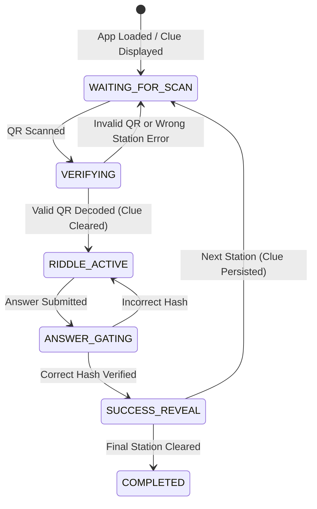

# Route:404 — Complete System & Process Documentation

This document explains the complete architecture, routing mathematics, QR code lifecycle, player state machine, and the route-aligned clue resolution system in **Route:404**.

---

## 1. System Overview & Architecture

Route:404 is a cryptographic, offline-first campus treasure hunt designed to support multiple concurrent teams with zero station collision.

```
                          ┌───────────────────────────┐
                          │     Admin Dashboard       │
                          │ - Checkpoint & Riddle CRUD│
                          │ - QR Code Payload Gen     │
                          │ - Latin Square Team Reg   │
                          └─────────────┬─────────────┘
                                        │
                                        ▼ Firestore Database
                          ┌───────────────────────────┐
                          │   teams & missionPacks    │
                          └─────────────┬─────────────┘
                                        │ (Downloaded on Login)
                                        ▼
                          ┌───────────────────────────┐
                          │      Player PWA / App     │
                          │ - Dexie.js (IndexedDB)    │
                          │ - SHA-256 Answer Verify   │
                          │ - Offline Sync Queue      │
                          │ - Dynamic Clue Engine     │
                          └───────────────────────────┘
```

---

## 2. Checkpoints & QR Code Generation

### 2.1 What Makes Up a Checkpoint
Each checkpoint represents a physical station on campus:
* **Order & Name:** Numerical sequence (`order: 1, 2, ...`) and human-readable station name.
* **Building / Location:** Physical landmark.
* **Riddle Text:** The puzzle players must solve once they reach the station.
* **Hints (up to 3):** Progressive assistance hints unlocked by the team if stuck.
* **Answer & Hash:** Plaintext is never stored. It is hashed using **SHA-256** (`answerHashHex`) before writing to Firestore.
* **Secret Token:** A 16-byte random hex token (`crypto.getRandomValues`) unique to that checkpoint.
* **Destination Clue / Location Hint (`nextDestinationLabel`):** The poetic or cryptic clue describing how to find this checkpoint.

### 2.2 QR Code Payload Format
The QR code pasted at the physical station contains a compact payload:
```
ROUTE404:<checkpointId>:<secretToken>
```
* **Tamper Resistance:** A player cannot simply guess or type a station ID; the physical QR contains the random `secretToken` that must match the mission pack.
* **Management Controls:** The admin can download high-resolution PNGs, edit any riddle/answer/hints directly, or delete obsolete checkpoints with real-time Firestore synchronization.

---

## 3. Latin Square Routing Mechanism

To prevent 10–20 teams from clustering at the same station simultaneously, routes are generated using a **Latin Square circular shift**:

$$\text{Route}_k[i] = \text{Checkpoints}[(i + k) \pmod N]$$

Where:
* $N$ = Total number of checkpoints.
* $k$ = Team index ($0, 1, \dots, N-1$).
* $i$ = Step index in the team's hunt ($0, 1, \dots, N-1$).

### Example with 5 Stations (A, B, C, D, E):
* **Team 0 ($k=0$):** `[A → B → C → D → E]`
* **Team 1 ($k=1$):** `[B → C → D → E → A]`
* **Team 2 ($k=2$):** `[C → D → E → A → B]`
* **Team 3 ($k=3$):** `[D → E → A → B → C]`
* **Team 4 ($k=4$):** `[E → A → B → C → D]`

> **Key Rule:** At any time step $i$, no two teams are ever at the same station.

---

## 4. The Route-Aligned Clue Resolution Process

### 4.1 The Problem That Was Occurring
Previously, each riddle entry in a team's mission pack was saving:
```javascript
// Previous flawed mapping:
riddles[i].nextDestLabelPlaintext = cp.nextDestinationLabel; // Clue of current station cp!
```
When Team 1 (assigned `[B → C → D → E → A]`) solved Station B:
1. The app revealed Station B's static label (which described Station B itself or a hardcoded default).
2. The team followed that misleading hint and arrived at a station that was **not** Station C.
3. Upon scanning that QR code, the system checked:
   $$\text{scannedId} \stackrel{?}{=} \text{pack.route}[1]\ (\text{Station C})$$
4. It threw: `"Wrong station! Check your route."` because the hint led to the wrong physical location.

---

### 4.2 The Solution: Dynamic Route-Aligned Clues

Clues are now linked dynamically based on **this specific team's route order**:

```
[Start] ─────────► [Station 0] ─────────► [Station 1] ─────────► [Station 2] ──► [HQ]
   │                    │                    │                    │
   ▼                    ▼                    ▼                    ▼
Shows starting       Solves Riddle 0      Solves Riddle 1      Solves Last Riddle
clue for route[0]    reveals clue for     reveals clue for     reveals "All clear!
                     route[1]             route[2]             Return to HQ"
```

#### Code Implementation in Mission Pack Generation:
```javascript
for (let i = 0; i < route.length; i++) {
  const cp = checkpoints.find((c) => c.id === route[i]);
  const nextCp = (i + 1 < route.length)
    ? checkpoints.find((c) => c.id === route[i + 1])
    : null;

  // The clue revealed after solving riddle i MUST lead to route[i + 1]!
  const nextClueText = nextCp
    ? (nextCp.nextDestinationLabel || `Proceed to ${nextCp.name}`)
    : "All checkpoints cleared! Report to HQ to claim victory.";

  riddles.push({
    index: i,
    checkpointId: cp.id,
    plaintextRiddle: cp.riddleText,
    plaintextHints: cp.hints,
    answerHashHex: cp.answerHashHex,
    stationClue: cp.nextDestinationLabel,  // Clue to reach THIS station
    nextDestLabelPlaintext: nextClueText,  // Clue to reach NEXT station
  });
}
```

---

## 5. Player State Machine & User Experience

The player client transitions through the following state machine:



### Stage 1: `WAITING_FOR_SCAN` (Scanner Screen & Clue Display)
* **Starting Station (Station 1):** The screen displays a prominent **`STARTING STATION CLUE`** box detailing the clue for `route[0]`.
* **Subsequent Stations:** Displays the **`NEXT STATION CLUE`** box containing the decrypted destination hint unlocked from the previous station.
* **Persistent:** Even if the player closes the browser or refreshes while navigating across campus, the clue remains stored in IndexedDB (`saveTeamSession`) and stays visible until the next station's QR is scanned.

### Stage 2: `VERIFYING` (Station Validation)
* Player scans QR code: `ROUTE404:<stationId>:<token>`.
* Verifies:
  1. `stationId === pack.route[currentIndex]`
  2. `token === riddle.secretToken`
* If valid:
  * Automatically dismisses the previous station clue (`setCurrentClue(null)`).
  * Transitions to `RIDDLE_ACTIVE`.

### Stage 3: `RIDDLE_ACTIVE` (Solving the Riddle)
* Displays decrypted transmission with a cyberpunk typewriter effect.
* Players can progressively reveal Hint 1, Hint 2, and Hint 3 if stuck.
* Players enter their answer into the submission field.

### Stage 4: `ANSWER_GATING` (Cryptographic Verification)
* Computes:
  $$\text{SHA-256}(\text{normalise}(\text{answer})) \stackrel{?}{=} \text{riddle.answerHashHex}$$
* Works completely offline using local cryptographic operations.
* If incorrect: Displays a shake animation with an error banner.
* If correct:
  * Unlocks `nextDestLabelPlaintext` (the clue leading to `route[currentIndex + 1]`).
  * Queues the completion event locally in Dexie IndexedDB.
  * Synchronizes to Firestore asynchronously in the background.

### Stage 5: `SUCCESS_REVEAL`
* Displays animated padlock unlock sequence and reveals the decrypted clue for the next destination.
* Clicking **"Proceed to Next Checkpoint"** moves the player back to `WAITING_FOR_SCAN`.
* The newly unlocked clue appears in the HUD on the scanner page until the next QR code is scanned and decoded.

### Stage 6: `COMPLETED`
* Triggered after clearing the final station in `route`.
* Shows victory screen, final stats, and directs the team to HQ.

---

## 6. Summary of Key Files

| File | Purpose |
|---|---|
| [`src/lib/routing.js`](file:///d:/Zairza/Zairzest%206.0/Treassure%20hunt/src/lib/routing.js) | Latin Square route generator (`assignRoute`, `nextTeamIndex`). |
| [`src/components/admin/QRPayloadGenerator.jsx`](file:///d:/Zairza/Zairzest%206.0/Treassure%20hunt/src/components/admin/QRPayloadGenerator.jsx) | QR code rendering, download, and inline Edit/Delete management. |
| [`src/components/admin/CheckpointForm.jsx`](file:///d:/Zairza/Zairzest%206.0/Treassure%20hunt/src/components/admin/CheckpointForm.jsx) | Modal form to edit riddles, hints, answers, tokens, and location clues. |
| [`src/components/admin/TeamRegistrationForm.jsx`](file:///d:/Zairza/Zairzest%206.0/Treassure%20hunt/src/components/admin/TeamRegistrationForm.jsx) | Generates route-aligned mission packs where each riddle unlocks the next station's clue. |
| [`src/hooks/useGameState.js`](file:///d:/Zairza/Zairzest%206.0/Treassure%20hunt/src/hooks/useGameState.js) | Central state machine, clue persistence, offline queueing, and legacy pack normalization. |
| [`src/components/player/states/WaitingForScan.jsx`](file:///d:/Zairza/Zairzest%206.0/Treassure%20hunt/src/components/player/states/WaitingForScan.jsx) | QR scanner interface displaying active station clues until QR decoding. |
| [`src/lib/crypto.js`](file:///d:/Zairza/Zairzest%206.0/Treassure%20hunt/src/lib/crypto.js) | SHA-256 hashing and AES-256-GCM encryption/decryption routines. |
| [`src/lib/db.js`](file:///d:/Zairza/Zairzest%206.0/Treassure%20hunt/src/lib/db.js) | Dexie IndexedDB client schema for offline session and completion queue. |
