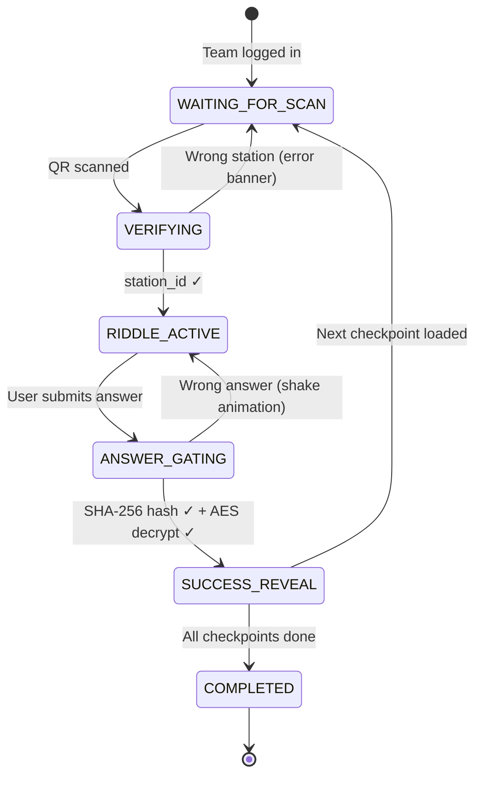

# Route:404 PWA — Implementation Plan

> **✅ Theme**: Black & Neon Green — terminal/Matrix hacker aesthetic. Deep black backgrounds, neon `#00ff41` green accents, green-on-black monospace text, CRT scanline overlay, phosphor-glow effects.

## Goal Description

Build **Route:404**, a production-ready Progressive Web Application for a large-scale university tech treasure hunt. The app delivers a **cinematic, offline-first** experience with two distinct roles:

- **Player Mobile PWA**: Sequential cryptographic gameplay — scan QR codes, solve riddles, unlock next destinations via AES-256-GCM decryption.
- **Admin Command Center**: Team registration with Latin Square routing, live campus radar grid, and QR payload generator.

The system uses **Next.js 14 App Router**, **Firebase Firestore + Auth**, **Dexie.js** for IndexedDB offline queuing, **Framer Motion** for cinematic animations, and **html5-qrcode** for camera scanning.

> **✅ Clarification Applied**: All checkpoints (locations), riddle text, hints, answer hashes, and secret tokens are **fully dynamic** — created and managed by the Admin from the dashboard UI. There are zero hardcoded locations. The number of checkpoints is variable, and all Latin Square routing recalculates live based on the current checkpoint count in Firestore.

---

## User Review Required

> [!IMPORTANT]
> **Firebase Project**: You will need an active Firebase project with Firestore and Authentication enabled. After approval, I'll scaffold the app and provide the `firebase.json` / env var instructions. You'll need to paste your Firebase config keys into a `.env.local` file.

> [!IMPORTANT]
> **Backend Choice Confirmed as Firebase**: The plan uses Firebase (Firestore + Anonymous/PIN Auth). The "4-digit PIN" login maps to a custom auth token approach — teams authenticate with their Team Name + PIN via a Firestore lookup (no native Firebase Auth for teams; Admin uses email/password Firebase Auth).

> [!WARNING]
> **AES-256-GCM in the Browser**: The Web Crypto API (`SubtleCrypto`) is used natively — no third-party crypto library needed. The answer string is hashed via SHA-256 and used as both the verification hash AND the derived AES key material. This means **if the answer is weak (short/common), the encryption is weaker**. This is an intentional design trade-off for a game context.

> [!CAUTION]
> **html5-qrcode + Next.js SSR**: `html5-qrcode` is a client-only library that accesses `window` and `navigator`. It must be loaded with `dynamic(() => import(...), { ssr: false })`. The plan accounts for this.

---

## Open Questions

> [!IMPORTANT]
> **Q1: Checkpoints are now fully dynamic** ✅ — Admin creates/edits/deletes checkpoints (name, building, riddle, hints, answer, secret token) from the dashboard. The Latin Square routing auto-adjusts to however many checkpoints exist at game time.

> [!IMPORTANT]
> **Q2: QR Code Format for Printing?** The plan generates QR codes inline using `qrcode` npm package rendered as `<canvas>` elements with a "Download PNG" button. Would you prefer PDF generation instead?

> [!IMPORTANT]
> **Q3: Firebase vs. Mock Backend?** Do you already have a Firebase project, or should I include a **local mock mode** (all data in localStorage/Dexie only) so the app is fully testable without Firebase credentials?

---

## Proposed Changes

### Project Initialization

#### [NEW] Next.js 14 App Router project scaffold

```bash
npx -y create-next-app@latest ./ \
  --typescript \
  --tailwind \
  --app \
  --src-dir \
  --import-alias "@/*" \
  --no-git
```

**Key `package.json` dependencies to install:**

| Package | Version | Purpose |
|---|---|---|
| `framer-motion` | ^11 | Cinematic animations |
| `dexie` | ^3.2 | IndexedDB offline queue |
| `firebase` | ^10 | Firestore + Auth |
| `html5-qrcode` | ^2.3 | Camera QR scanning |
| `qrcode` | ^1.5 | QR code image generation (admin) |
| `next-pwa` | ^5.6 | Service worker + PWA manifest |
| `@fontsource/inter` | ^5 | Typography |
| `@fontsource/jetbrains-mono` | ^5 | Monospace riddle font |

---

### Directory Structure

```
src/
├── app/
│   ├── layout.tsx                  # Root layout — Nav + NetworkStatusBar
│   ├── page.tsx                    # Root → redirects based on role
│   ├── globals.css                 # Dark theme design tokens
│   ├── player/
│   │   ├── page.tsx                # Player entry (login or game)
│   │   └── game/
│   │       └── page.tsx            # Active gameplay state machine
│   └── admin/
│       ├── page.tsx                # Admin login
│       └── dashboard/
│           ├── page.tsx            # Admin dashboard layout
│           ├── checkpoints/
│           │   └── page.tsx        # ✨ NEW: Checkpoint Manager (CRUD)
│           ├── register/
│           │   └── page.tsx        # Team registration form
│           ├── radar/
│           │   └── page.tsx        # Live campus radar matrix
│           └── qr-generator/
│               └── page.tsx        # QR payload generator & print
│
├── components/
│   ├── layout/
│   │   ├── NavBar.tsx              # Role switcher + network toggle
│   │   └── NetworkStatusBar.tsx    # Banner for offline state
│   ├── player/
│   │   ├── LoginForm.tsx           # Team login with PIN
│   │   ├── GameStateMachine.tsx    # Orchestrates all 5 states
│   │   ├── states/
│   │   │   ├── WaitingForScan.tsx  # State 1: Camera prompt
│   │   │   ├── ScanVerification.tsx# State 2: Verify station_id
│   │   │   ├── RiddleActive.tsx    # State 3: Riddle display
│   │   │   ├── AnswerGating.tsx    # State 4: Answer submission
│   │   │   └── SuccessReveal.tsx   # State 5: Padlock animation + next dest
│   │   ├── QRScanner.tsx           # html5-qrcode wrapper (dynamic import)
│   │   └── ProgressTrail.tsx       # Visual step progress indicator
│   └── admin/
│       ├── CheckpointManager.tsx   # ✨ NEW: Full CRUD for checkpoints
│       ├── CheckpointForm.tsx      # ✨ NEW: Add/edit checkpoint modal
│       ├── TeamRegistrationForm.tsx
│       ├── CampusRadar.tsx         # Live matrix grid
│       └── QRPayloadGenerator.tsx  # Canvas QR code generation
│
├── lib/
│   ├── crypto.ts                   # SHA-256 hash + AES-256-GCM encrypt/decrypt
│   ├── db.ts                       # Dexie.js schema + offline queue
│   ├── firebase.ts                 # Firebase init + Firestore helpers
│   ├── routing.ts                  # Latin Square route assignment (dynamic N)
│   └── sync.ts                     # Background sync (Dexie → Firestore)
│                                   # ✅ NO constants.ts — checkpoints live in Firestore
├── types/
│   └── route404.ts                 # All TypeScript interfaces
│
└── hooks/
    ├── useNetworkStatus.ts         # Online/offline + manual override
    ├── useGameState.ts             # State machine hook
    ├── useOfflineSync.ts           # Auto-flush Dexie queue
    ├── useCheckpoints.ts           # ✨ NEW: Real-time Firestore checkpoint list
    └── useFirestore.ts             # Real-time Firestore subscriptions
```

---

### Core TypeScript Interfaces

#### [NEW] `src/types/route404.ts`

```typescript
/**
 * Checkpoint — fully admin-defined, stored in Firestore.
 * N is variable; admin adds/removes checkpoints at any time
 * (before the hunt starts).
 */
export interface Checkpoint {
  id: string;              // Firestore doc ID (auto or slug)
  name: string;            // Display name e.g. "Zairza Lab"
  building: string;        // Physical location label / map hint
  secretToken: string;     // Random hex, embedded in QR payload
  order: number;           // Admin-set display order (used for grid)
  riddleText: string;      // Plain text riddle for this station
  hints: string[];         // Array of progressive hints (0–3 items)
  answerHashHex: string;   // SHA-256(lowercase(trim(correctAnswer)))
  // The answer itself is NEVER stored — only its hash.
  // On the server side, the admin enters the answer when creating
  // the checkpoint; the app hashes it and stores only the hash.
  nextDestinationLabel?: string; // "Your next stop is..." — shown after unlock
}

/**
 * What gets fetched at login and cached in Dexie.
 * Riddle 0 is plaintext. Riddles 1..N are AES-GCM encrypted
 * using the answer of the PREVIOUS riddle as key material.
 */
export interface MissionPack {
  teamId: string;
  route: string[];           // Ordered checkpoint IDs for this team
  riddles: RiddleEntry[];    // Length = route.length
}

export interface RiddleEntry {
  index: number;
  checkpointId: string;
  plaintextRiddle?: string;    // Only set for index === 0
  ciphertextB64?: string;      // AES-GCM encrypted blob for index > 0
  ivB64?: string;              // AES-GCM IV, stored alongside ciphertext
  hintsEncryptedB64?: string[]; // Hints encrypted for index > 0
  plaintextHints?: string[];   // Only set for index === 0
  answerHashHex: string;       // SHA-256(lowercase(trim(answer)))
  nextDestLabelCiphertextB64?: string; // Encrypted "go to X" for index > 0
  nextDestLabelPlaintext?: string;     // For index === 0
}

// Offline sync event queued in Dexie
export interface CompletionEvent {
  id?: number;             // Dexie auto-id
  teamId: string;
  stationId: string;
  timestamp: number;
  synced: boolean;
}

// Team record in Firestore
export interface Team {
  id: string;
  name: string;
  leaderName: string;
  pinHash: string;         // SHA-256 of the 4-digit PIN
  routeIndex: number;      // k in Latin Square: Route_k[i] = checkpoints[(i+k)%N]
  currentCheckpointIndex: number;
  completedAt?: number;
}

// Game state machine
export enum GameState {
  WAITING_FOR_SCAN = "WAITING_FOR_SCAN",
  VERIFYING = "VERIFYING",
  RIDDLE_ACTIVE = "RIDDLE_ACTIVE",
  ANSWER_GATING = "ANSWER_GATING",
  SUCCESS_REVEAL = "SUCCESS_REVEAL",
  COMPLETED = "COMPLETED",
}

// Admin form input for creating/editing a checkpoint
export interface CheckpointFormData {
  name: string;
  building: string;
  order: number;
  riddleText: string;
  hints: string[];       // Up to 3 hints, can be empty strings
  answer: string;        // Raw answer — hashed before saving, never persisted
  nextDestinationLabel: string;
}
```

---

### Cryptography Layer

#### [NEW] `src/lib/crypto.ts`

```typescript
// SHA-256 hash (returns lowercase hex string)
export async function sha256(input: string): Promise<string> {
  const buf = await crypto.subtle.digest(
    "SHA-256",
    new TextEncoder().encode(input)
  );
  return Array.from(new Uint8Array(buf))
    .map(b => b.toString(16).padStart(2, "0"))
    .join("");
}

// Derive a 256-bit AES-GCM key from a passphrase (the answer string)
async function deriveKey(passphrase: string): Promise<CryptoKey> {
  const keyMaterial = await crypto.subtle.importKey(
    "raw",
    new TextEncoder().encode(passphrase),
    { name: "PBKDF2" },
    false,
    ["deriveKey"]
  );
  return crypto.subtle.deriveKey(
    {
      name: "PBKDF2",
      salt: new TextEncoder().encode("route404-2026"),
      iterations: 100_000,
      hash: "SHA-256",
    },
    keyMaterial,
    { name: "AES-GCM", length: 256 },
    false,
    ["encrypt", "decrypt"]
  );
}

// AES-256-GCM encrypt — returns base64 string (iv prepended)
export async function encrypt(plaintext: string, passphrase: string): Promise<string> { ... }

// AES-256-GCM decrypt — takes base64 (iv+ciphertext), returns plaintext
export async function decrypt(ciphertextB64: string, passphrase: string): Promise<string> { ... }
```

---

### Latin Square Routing

#### [NEW] `src/lib/routing.ts`

```typescript
import type { Checkpoint } from "@/types/route404";

/**
 * Assigns a non-colliding circular route for team k.
 * Route_k[i] = sortedCheckpoints[(i + k) % N]
 *
 * This is a Latin Square shift: with N checkpoints and N teams,
 * no two teams occupy the same checkpoint at the same step index.
 * Works for any N — checkpoints are fetched live from Firestore.
 */
export function assignRoute(
  teamIndex: number,
  checkpoints: Checkpoint[]   // Passed in, not hardcoded
): string[] {
  // Sort by admin-defined order before routing
  const sorted = [...checkpoints].sort((a, b) => a.order - b.order);
  const N = sorted.length;
  return sorted.map((_, i) => sorted[(i + teamIndex) % N].id);
}

/**
 * Returns the next k value that ensures no starting collision.
 * Simply wraps around modulo checkpoint count.
 */
export function nextTeamIndex(
  existingTeamCount: number,
  checkpointCount: number      // Dynamic N, not hardcoded
): number {
  return existingTeamCount % checkpointCount;
}
```

---

### Dexie.js Database

#### [NEW] `src/lib/db.ts`

```typescript
import Dexie, { type Table } from "dexie";
import type { CompletionEvent, MissionPack } from "@/types/route404";

export class Route404DB extends Dexie {
  completionQueue!: Table<CompletionEvent>;
  missionPacks!: Table<MissionPack & { id: string }>;

  constructor() {
    super("Route404DB");
    this.version(1).stores({
      completionQueue: "++id, teamId, synced",
      missionPacks: "teamId",
    });
  }
}

export const db = new Route404DB();

// Queue a completion event
export async function queueCompletion(event: Omit<CompletionEvent, "id" | "synced">) {
  await db.completionQueue.add({ ...event, synced: false });
}

// Fetch all unsynced events
export async function getUnsyncedEvents(): Promise<CompletionEvent[]> {
  return db.completionQueue.where("synced").equals(0).toArray();
}

// Mark events as synced
export async function markSynced(ids: number[]) {
  await db.completionQueue.bulkUpdate(
    ids.map(id => ({ key: id, changes: { synced: true } }))
  );
}
```

---

### Background Sync Hook

#### [NEW] `src/hooks/useOfflineSync.ts`

```typescript
"use client";
import { useEffect } from "react";
import { getUnsyncedEvents, markSynced } from "@/lib/db";
import { pushCompletionEvents } from "@/lib/firebase";
import { useNetworkStatus } from "./useNetworkStatus";

export function useOfflineSync() {
  const { isOnline } = useNetworkStatus();

  useEffect(() => {
    if (!isOnline) return;
    (async () => {
      const events = await getUnsyncedEvents();
      if (events.length === 0) return;
      await pushCompletionEvents(events);
      await markSynced(events.map(e => e.id!));
    })();
  }, [isOnline]);
}
```

---

### Game State Machine

#### [NEW] `src/hooks/useGameState.ts`

The state machine transitions are:



---

### Admin Dashboard — Live Radar

#### [NEW] `src/components/admin/CampusRadar.tsx`

Real-time matrix powered by a Firestore `onSnapshot` listener:

```
         | Lib | Zairza | Mech | Audi | CSE | ... |
Team 001 |  ✓  |  🔴   |      |      |     |     |
Team 002 |     |   ✓   |  🔴  |      |     |     |
Team 003 |     |       |   ✓  |  🔴  |     |     |
```

- ✓ = completed (green)
- 🔴 = currently attempting (pulsing red dot)
- empty = not yet reached

---

### PWA Configuration

#### [NEW] `next.config.ts` (with `next-pwa`)

```typescript
import withPWA from "next-pwa";

export default withPWA({
  dest: "public",
  register: true,
  skipWaiting: true,
  disable: process.env.NODE_ENV === "development",
})({
  // next config
});
```

#### [NEW] `public/manifest.json`

```json
{
  "name": "Route:404",
  "short_name": "Route:404",
  "theme_color": "#0f172a",
  "background_color": "#0f172a",
  "display": "standalone",
  "orientation": "portrait",
  "start_url": "/player",
  "icons": [
    { "src": "/icon-192.png", "sizes": "192x192", "type": "image/png" },
    { "src": "/icon-512.png", "sizes": "512x512", "type": "image/png" }
  ]
}
```

---

### UI Design System

#### [NEW] `src/app/globals.css`

Design tokens:

```css
:root {
  /* ── Core Black & Green Theme ── */
  --bg-primary:    #000000;        /* Pure terminal black */
  --bg-secondary:  #0a0a0a;        /* Card / panel black */
  --bg-tertiary:   #111111;        /* Subtle depth layer */

  /* Neon green palette */
  --green-bright:  #00ff41;        /* Primary neon green (Matrix) */
  --green-mid:     #00c832;        /* Hover / active states */
  --green-dim:     #00801e;        /* Muted / secondary text */
  --green-glow:    rgba(0,255,65,0.15); /* Glow halos / borders */
  --green-trace:   rgba(0,255,65,0.05); /* Scanline overlay tint */

  /* Semantic colours */
  --accent-success: #00ff41;       /* Correct answer / unlock */
  --accent-error:   #ff2020;       /* Wrong scan / wrong answer */
  --accent-warn:    #ffaa00;       /* Hint reveal cost */

  /* Text */
  --text-primary:  #00ff41;        /* Primary green text */
  --text-secondary:#a0ffb8;        /* Softer green for body */
  --text-muted:    #2d6e3e;        /* Dimmed labels */
  --text-on-green: #000000;        /* Text on filled green buttons */

  /* Borders */
  --border:        rgba(0,255,65,0.25);
  --border-bright: rgba(0,255,65,0.7);

  /* Typography */
  --font-display:  "Share Tech Mono", "JetBrains Mono", monospace; /* All headings */
  --font-mono:     "JetBrains Mono", monospace;                     /* Riddles / code */
  --font-body:     "Inter", sans-serif;                             /* UI labels */
}

/* CRT scanline overlay applied to <body> */
body::after {
  content: "";
  position: fixed;
  inset: 0;
  pointer-events: none;
  background: repeating-linear-gradient(
    0deg,
    transparent,
    transparent 2px,
    rgba(0, 255, 65, 0.03) 2px,
    rgba(0, 255, 65, 0.03) 4px
  );
  z-index: 9999;
}
```

**Visual language:**
- All backgrounds: pure `#000` with green border glows (`box-shadow: 0 0 12px var(--green-glow)`)
- Buttons: black background, `1px solid var(--green-bright)`, green text → on hover: filled green with black text
- Input fields: black bg, green caret, green border-glow on focus
- Progress bars / status indicators: green fill on black track
- Error states: red (`#ff2020`) — the ONLY non-green accent color
- Hint cost indicator: amber (`#ffaa00`) — only used for hint penalty badge

**Google Fonts to load:** `Share Tech Mono` (display headings) + `JetBrains Mono` (riddle body)

**Key animations (Framer Motion):**

| Animation | Used in | Effect |
|---|---|---|
| `padlockUnlock` | SuccessReveal | SVG padlock opens with spring physics; strokes animate green |
| `terminalType` | Riddle text | Green characters typed out one-by-one, cursor blinks |
| `glitchText` | Error states | RGB-split green-on-black glitch flicker on wrong answer |
| `slideIn` | State transitions | Cinematic page-level slide with green motion blur trail |
| `radarPulse` | CampusRadar active dot | Expanding green ring pulse (`box-shadow` keyframes) |
| `matrixRain` | Loading screens | Falling green character rain (canvas) |
| `phosphorBlink` | Cursor / prompts | Classic terminal cursor blink at 1.2s interval |
| `greenFlareBurst` | Success state | Particle burst in neon green on checkpoint completion |

---

### Firestore Data Model

```
firestore/
├── teams/
│   └── {teamId}/
│       ├── name: string
│       ├── leaderName: string
│       ├── pinHash: string
│       ├── routeIndex: number
│       ├── currentCheckpointIndex: number
│       └── completedAt?: timestamp
│
├── checkpoints/               ← FULLY DYNAMIC (admin-managed)
│   └── {checkpointId}/        ← Admin creates N of these
│       ├── name: string        ← e.g. "Zairza Lab"
│       ├── building: string    ← Physical location hint
│       ├── secretToken: string ← Auto-generated hex on creation
│       ├── order: number       ← Admin-set display/routing order
│       ├── riddleText: string  ← The riddle text
│       ├── hints: string[]     ← Progressive hints array (0–3)
│       ├── answerHashHex: str  ← SHA-256 of answer (answer itself NOT stored)
│       └── nextDestinationLabel: string
│
├── completionEvents/
│   └── {eventId}/
│       ├── teamId: string
│       ├── stationId: string
│       └── timestamp: timestamp
│
└── missionPacks/
    └── {teamId}/               ← Generated at team registration time
        ├── route: string[]      ← Latin Square assigned checkpoint IDs
        └── riddles: RiddleEntry[] ← Encrypted per-checkpoint riddle data
```

**Firestore Security Rules:**
- Teams can only read their own `missionPacks/{teamId}`
- Teams can write to `completionEvents` (append only)
- **Checkpoints** are read-only for authenticated (non-admin) users
- Admin (email/password auth) has full read/write on all collections

---

### Component Breakdown — Player PWA

#### State 1: `WaitingForScan.tsx`
- Full-screen animated scan prompt
- Neon cyan camera icon with breathing glow animation
- Button → opens QR scanner modal
- Shows **current target building name** (fetched dynamically from mission pack)

#### State 2: `ScanVerification.tsx`
- Inline scan result display
- If `station_id` matches expected → smooth green transition
- If mismatch → red glitch error banner with shake animation

#### State 3: `RiddleActive.tsx`
- Monospace font riddle text with typewriter animation (fetched from mission pack)
- **Progressive hint system**: "Reveal Hint 1 / 2 / 3" buttons (hints unlock sequentially)
- Each hint costs a "hint token" shown in the UI
- Dark card with cyan border glow
- "Submit Answer" CTA button

#### State 4: `AnswerGating.tsx`
- Input field with monospace font
- SHA-256 computed client-side on submit
- Loading spinner during hash comparison + AES-256-GCM decryption of next riddle

#### State 5: `SuccessReveal.tsx`
- SVG padlock opens with spring animation (Framer Motion)
- Particle burst effect
- **Next destination label** revealed dynamically (decrypted from ciphertext)
- Confetti or scanline wipe transition

---

### Component Breakdown — Admin Dashboard

#### ✨ NEW: `CheckpointManager.tsx` + `CheckpointForm.tsx`

This is the core dynamic feature — a full CRUD dashboard for checkpoints:

| Feature | Detail |
|---|---|
| **Create** | Modal form: Name, Building, Order #, Riddle text, up to 3 Hints, Answer (hashed on save), Next Destination Label |
| **Edit** | Inline edit with optimistic UI update |
| **Delete** | Soft confirm dialog, removes from Firestore |
| **Secret Token** | Auto-generated `crypto.randomUUID()` on creation, shown read-only |
| **Answer field** | Masked input; on save, SHA-256 hashed → only hash stored |
| **Drag-to-Reorder** | Admin drags checkpoint cards to set routing order |
| **Count display** | Header shows `N checkpoints configured — Latin Square supports up to N teams` |

#### `TeamRegistrationForm.tsx`
- Input: Team Name, Leader Name, 4-digit PIN (masked)
- Reads live checkpoint count from Firestore via `useCheckpoints()` hook
- Auto-computes `routeIndex = existingTeams.length % N` (N = live checkpoint count)
- Builds and writes mission pack (encrypting riddles 1..N with prev answer)
- Shows assigned route preview: "Team will visit: Zairza Lab → Library → ..."

#### `CampusRadar.tsx`
- CSS Grid: teams (rows) × **dynamic checkpoints** (columns, sorted by order)
- Real-time `onSnapshot` Firestore listener on both `teams` and `checkpoints`
- Grid column count adjusts automatically to N checkpoints
- Pulsing neon dot at current checkpoint
- Color coding: grey (not reached) → cyan (in progress) → emerald (completed)

#### `QRPayloadGenerator.tsx`
- Reads all checkpoints dynamically from Firestore
- For each: renders `qrcode` canvas with payload `ROUTE404:<station_id>:<secretToken>`
- "Download PNG" button per QR code
- "Print All" button → `window.print()` with print stylesheet

---

## Verification Plan

### Automated Tests

> No automated test framework configured by default (keeps build lightweight). The following manual checks serve as the acceptance criteria.

### Manual Verification Checklist

| # | Test | Expected |
|---|---|---|
| 1 | Run `npm run build` | Zero errors, PWA manifest generated |
| 2 | Run `npm run dev` → open `/admin` | Admin login renders, dark theme visible |
| 3 | Register a team | Team appears in Firestore, route assigned correctly |
| 4 | Register 8 teams | Each starts at a different checkpoint (Latin Square) |
| 5 | Open `/player` → log in | Mission pack cached in Dexie (DevTools → Application → IndexedDB) |
| 6 | Scan correct QR → submit correct answer | Padlock animation plays, next state loads |
| 7 | Scan wrong QR | Error banner with shake animation |
| 8 | Toggle network → "Offline" → complete a station | Event queued in Dexie |
| 9 | Toggle network → "Online" | Queued events auto-flush to Firestore |
| 10 | Open `/admin/radar` | Real-time matrix updates as teams progress |
| 11 | Open `/admin/qr-generator` | QR codes render for all checkpoints, download works |
| 12 | Install PWA on mobile | App installs, works offline after first load |

### Build Verification

```bash
npm run build
# Expected: ✓ Compiled successfully
# Expected: PWA files generated in public/

npm run dev
# Open: http://localhost:3000
```

---

## Implementation Order

1. **Phase 1** — Project scaffold + design system (globals.css, layout, NavBar)
2. **Phase 2** — TypeScript types + crypto lib + Dexie db + Firebase init
3. **Phase 3** — Admin: Registration form + Latin Square routing
4. **Phase 4** — Admin: Campus Radar + QR Generator
5. **Phase 5** — Player: Login + Dexie mission pack caching
6. **Phase 6** — Player: Game state machine + all 5 states + Framer Motion animations
7. **Phase 7** — PWA config (next-pwa, manifest, icons)
8. **Phase 8** — Background sync + network toggle
9. **Phase 9** — Polish: animations, responsiveness, error states
10. **Phase 10** — Build verification + README
